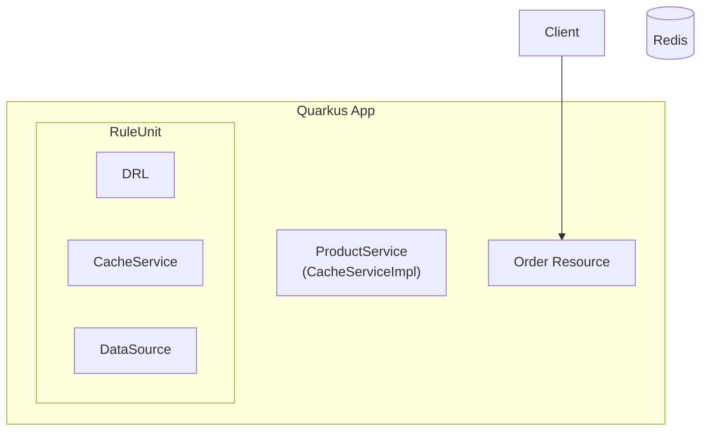

# rulebased_cache_pattern




Sample application for online sales ordering service using Quarkus, Drools, and Redis.
Calculation of charges is performed by RuleUnit of Drools.
By including a service for data access in RuleUnit, Redis can be accessed from the rules.

By using Redis as a cache service, fast data access from rules may be realized.

## env 

- wsl2 (Ubuntu)
- openjdk 17
- Quarkus 3.4.3
- Drools 8.44.0.Final
- Redis 7.2.2 (Docker Image)

## command

- docker images
```
docker pull redis:7.2.2
docker run --name redis_quarkus_test -p 6379:6379 redis:7.2.2
```

- url  
http://localhost:8080/q/swagger-ui


## reference

https://ja.quarkus.io/guides/redis

https://ja.quarkus.io/guides/openapi-swaggerui
