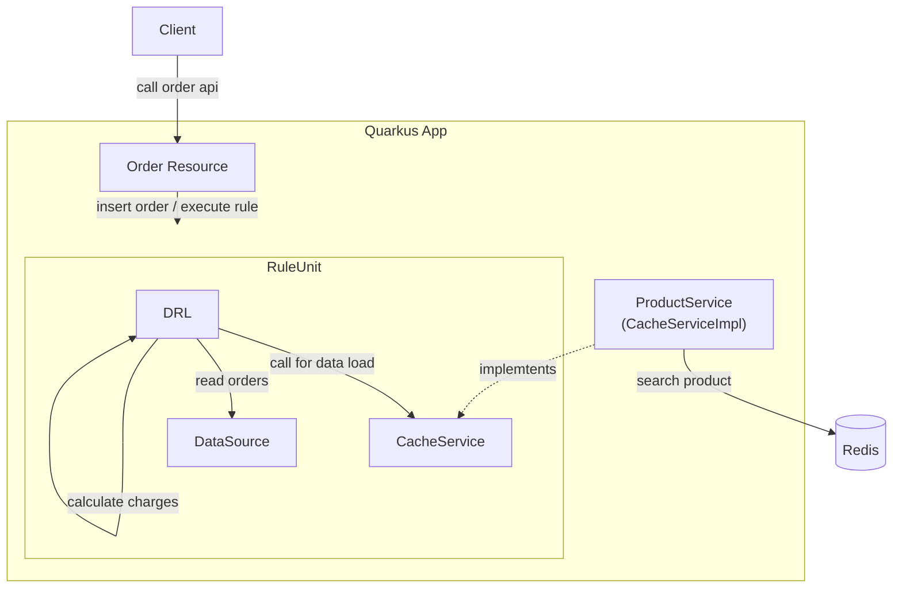

# rulebased_cache_pattern

Sample application for online sales ordering service using Quarkus, Drools, and Redis.
Calculation of charges is performed by RuleUnit of Drools.
By including a service for data access in RuleUnit, Redis can be accessed from the rules.

By using Redis as a cache service, fast data access from rules may be realized.

